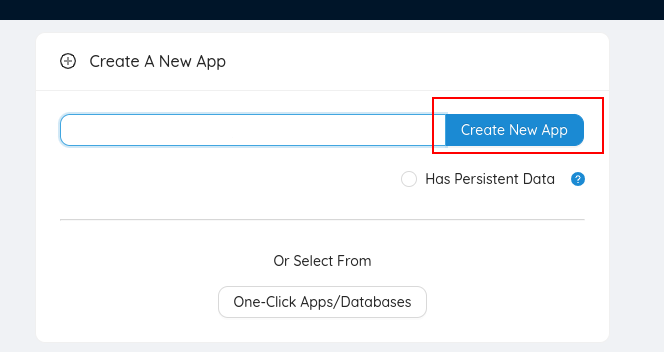
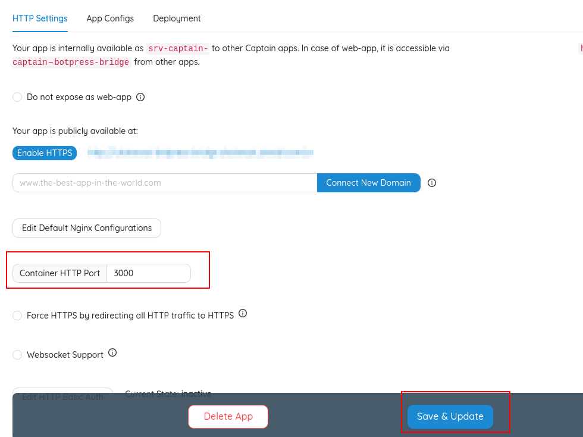
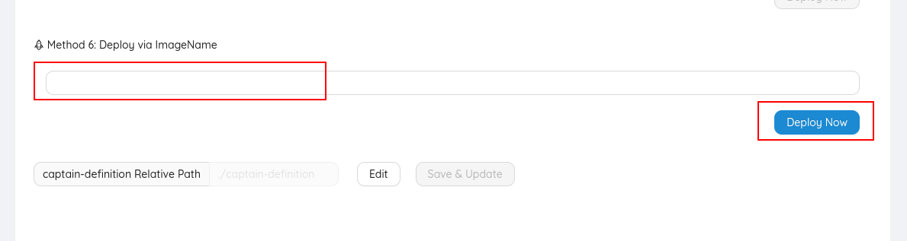

# About

This is a bridge connection squadwe botpress.

[Squadwe](https://github.com/squadwe/squadwe)
[Botpress](https://github.com/botpress/botpress)

# Running local

You need `ruby 3.0.3`
Clone this project:
```sh
git clone https://github.com/squadwe/squadwe-botpress-bridge.git
cd squadwe-botpress-bridge
```

Copy configuration file:
```sh
cp .env.example .env
```

Edit vars in file `.env`:
```sh
BOTPRESS_ENDPOINT=
BOTPRESS_BOT_ID=
SQUADWE_ENDPOINT=
SQUADWE_BOT_TOKEN=
```

Start server:
```sh
rails s
```


# Running tests

```sh
rails test
```


#  Create an agent bot

Go to your squadwe directory.  Start a rails console in your directory.

```
bundle exec rails c
```

Inside the rails console, type the following commands to create an agent bot and get its access token. Save the retrieved token as you would need it in further step.

```
bot = AgentBot.create!(name: "Botpress Bot", outgoing_url: "https://SQUADWE_BOTPRESS_BRIDGE_URL/squadwe/webhook")
bot.access_token.token
```

Connect Agent Bot to your inbox by running the following command

```
inbox = Inbox.last
AgentBotInbox.create!(inbox: inbox, agent_bot: bot)
```


# Deploy CapRover

1 - Create new app


2 - Configure env vars

```
RAILS_ENV=production
SQUADWE_ENDPOINT=
SQUADWE_BOT_TOKEN=
BOTPRESS_ENDPOINT=
BOTPRESS_BOT_ID=
SECRET_KEY_BASE=
```

Generate random SECRET_KEY_BASE with
```
rake secret
```

3 - Configure http port
In http settings set `Container HTTP Port` to `3000`


4 - Deploy container
In deployment settings set `Deploy via ImageName` with `squadwe/squadwe-botpress-bridge:0` and deploy now.

